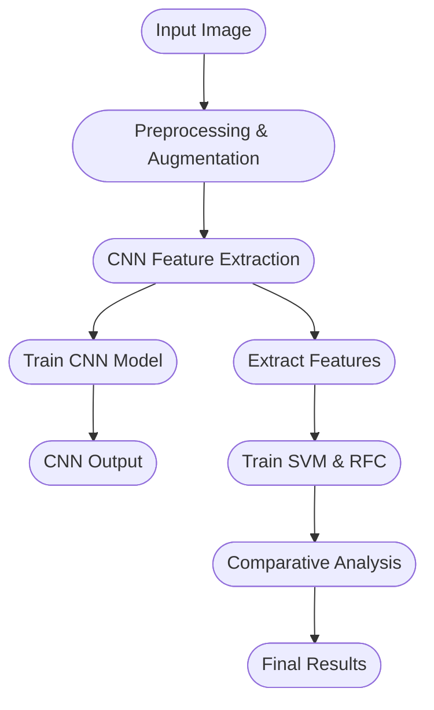

# Potato Leaf Disease Classification (A comparison study)

This repository contains the project documentation for the classification of potato leaf diseases. The project displays a comparison study that compares the performance deep learning (CNN) and traditional machine learning classifiers (SVM & RFC) for the task of classification of leaf diseases in potato plants. The feature extraction is done from the sequential CNN model layers only and then fed into SVM and RFC fot their training. A flowchart is provided in this readme for better understanding.

---

## Table of Contents

- [Introduction](#introduction)
- [Contribution](#contribution)
- [Dataset Description and Visualization](#dataset-description-and-visualization)
- [Algorithm and Methodology](#algorithm-and-methodology)
  - [Feature Extraction and Data Preparation](#feature-extraction-and-data-preparation)
  - [CNN Model Architecture](#cnn-model-architecture)
  - [Comparative Study Between Classifiers](#comparative-study-between-classifiers)
  - [Mathematical Equations](#mathematical-equations)
  - [Flow Diagram](#flow-diagram)
- [Hyperparameter Setup and Training Process](#hyperparameter-setup-and-training-process)
- [Experimental Results](#experimental-results)
- [Conclusion](#conclusion)
- [References](#references)

---

## Introduction

Potato is a crucial crop globally, but its yield is significantly impacted by diseases like Early Blight and Late Blight. This project aims to automate the detection of these diseases using a deep learning model to extract features from potato leaf images and traditional classifiers to perform the final classification. The approach supports enhanced accuracy and robustness, providing a valuable tool for sustainable agriculture.

---

## Contribution

- **Deep Learning Implementation:** Developed a Convolutional Neural Network (CNN) to automatically extract discriminative features from potato leaf images.
- **Hybrid Approach:** Employed the extracted CNN features to train Support Vector Machine (SVM) and Random Forest Classifier (RFC) models, ensuring a fair and direct comparison.
- **Data Augmentation:** Addressed class imbalance in the datasets by augmenting images to maintain uniform class distribution.
- **Comparative Analysis:** Evaluated the performance of CNN, SVM, and RFC models using metrics such as accuracy, F1-score, and recall.

---

## Dataset Description and Visualization

Two datasets from Kaggle are used in this project:

### PlantVillage Dataset
- **Classes:**
  - Potato Early Blight: 1000 images
  - Potato Late Blight: 1000 images
  - Potato Healthy: 152 images

### PLD Dataset

| **Set**      | **Class**      | **No. of Images** |
|--------------|----------------|-------------------|
| **Training** | Early Blight   | 1303              |
|              | Late Blight    | 1132              |
|              | Healthy        | 816               |
| **Validation** | Early Blight | 163               |
|              | Late Blight    | 151               |
|              | Healthy        | 102               |
| **Testing**  | Early Blight   | 162               |
|              | Late Blight    | 141               |
|              | Healthy        | 102               |

Sample visualizations from the datasets illustrate typical images for each class, helping to verify data quality and diversity.

---

## Algorithm and Methodology

### Feature Extraction and Data Preparation

The project utilizes a CNN to extract features from potato leaf images. Features are extracted from an intermediate layer of the CNN and saved for subsequent use in training the SVM and RFC models. This ensures that all classifiers operate on a consistent feature representation.

### CNN Model Architecture

The CNN is built using TensorFlow’s Keras API and follows a sequential architecture. The network consists of multiple convolutional and pooling layers, followed by flattening and dense layers, which automatically learn relevant features from the input images.

### Comparative Study Between Classifiers

- **CNN:** Directly classifies images using deep learning.
- **SVM and RFC:** Train on features extracted by the CNN, allowing for a performance comparison between deep learning and traditional machine learning approaches.

### Mathematical Equations

Key equations underpinning the project include:

- **Softmax Function:** Converts raw scores into probabilities.
- **Categorical Cross-Entropy Loss:** Measures the difference between true labels and predicted probabilities.
- **Convolution Operation:** Computes the feature maps from input images.
- **ReLU Activation Function:** Introduces non-linearity into the model.
- **Gradient Descent Update:** Optimizes the network’s weights.
- **Output Dimension Calculation:** Determines the size of the feature maps after convolution.

### Flow Diagram

## Hyperparameter Setup and Training Process

### CNN Model

- **Optimizer:** Adam  
- **Loss Function:** Sparse Categorical Cross-entropy (using probabilities, not logits)  
- **Metrics:** Accuracy  
- **Epochs:** 50  
- **Batch Size:** Defined per experiment  
- **Early Stopping:** Applied with a patience of 7 epochs to monitor validation loss and accuracy. The best model weights are restored if no improvement is observed.

## Hyperparameter Setup and Training Process

### CNN Model

- **Optimizer:** Adam  
- **Loss Function:** Sparse Categorical Cross-entropy (with `from_logits=False`)  
- **Metrics:** Accuracy  
- **Epochs:** 50  
- **Batch Size:** Specified per experiment  
- **Early Stopping:** Applied with a patience of 7 epochs, monitoring validation loss and accuracy; best weights are restored if no improvement is observed.

### SVM and RFC Models

- **Random Forest Classifier (RFC):** 100 estimators with `random_state=42`  
- **Support Vector Machine (SVM):** Radial Basis Function (RBF) kernel with `random_state=42`

*The training process is visualized using plots for accuracy and loss (for the CNN) as well as confusion matrices for all models.*

---

## Experimental Results

### CNN Model Performance

- **Training and Validation Accuracy:** Plotted across epochs.  
- **Training and Validation Loss:** Visualized to understand the learning curves.  
- **Confusion Matrix:** Provided for evaluating the CNN's performance on the test set.

### SVM and RFC Model Performance

- **Confusion Matrices:** Displayed for both SVM and RFC.  
- **Comparative Analysis:** A detailed table presents precision, recall, and F1-scores for CNN, SVM, and RFC.  
- **Bar Graph Comparison:** A graphical comparison of overall performance across the three models.

---

## Conclusion

The project demonstrates that while the CNN model slightly outperforms traditional classifiers, both SVM and RFC models achieve competitive results when trained on features extracted by the CNN. The use of image augmentation to address class imbalance significantly improved model robustness and generalization. This hybrid approach offers a promising solution for the early detection of potato leaf diseases, supporting sustainable agricultural practices.

---

## References

- [PlantVillage Dataset](https://www.kaggle.com/datasets/arjuntejaswi/plant-village)  
- [PLD Dataset](https://www.kaggle.com/datasets/rizwan123456789/potato-disease-leaf-datasetpld)  
- [TensorFlow Keras API Documentation](https://www.tensorflow.org/guide/keras)
